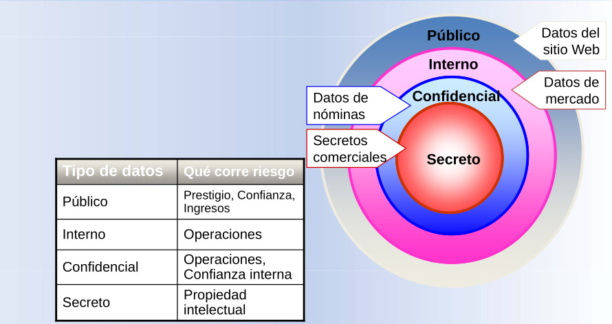

## Identificación de los riesgos para los datos

## Identificación de los riesgos para los servicios

- Ataques de denegación de servicio

- Bloquear el acceso a los recursos

- Puede desbordar la red, afectar desfavorablemente al rendimiento 
y causar fallos en el servidor

- Puede producir pérdida del servicio, prestigio, ingresos

## Amenazas

Las amenazas surgen a partir de la existencia de vulnerabilidades, es decir, que una amenaza solo puede existir
si existe una vulnerabilidad que pueda ser aprovechada,
e independientemente de que se comprometa o no la
seguridad de un sistema de información.

### Identificación de las amenazas posibles

* Ataque interno
* Ingeniería social
* Ataque organizativo
* Brecha de seguridad accidental
* Ataque automatizado con un equipo

 