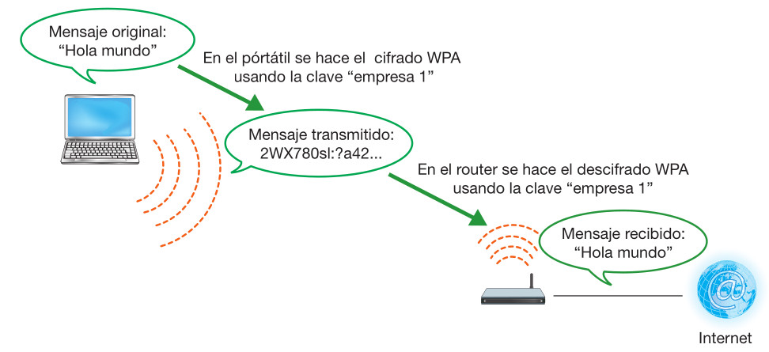
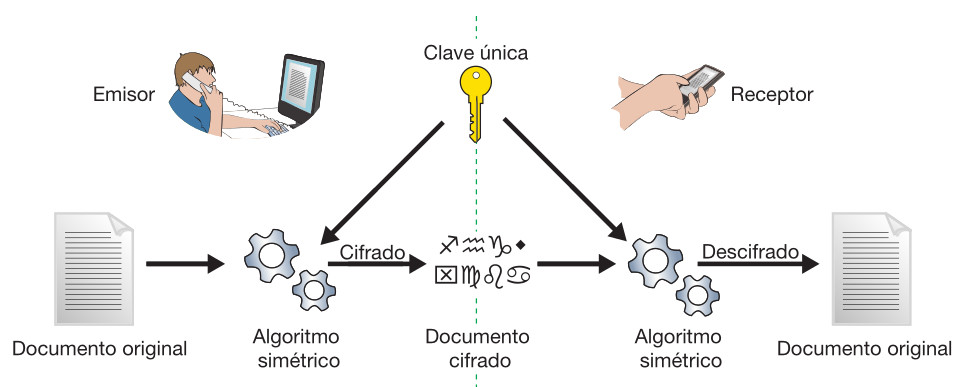
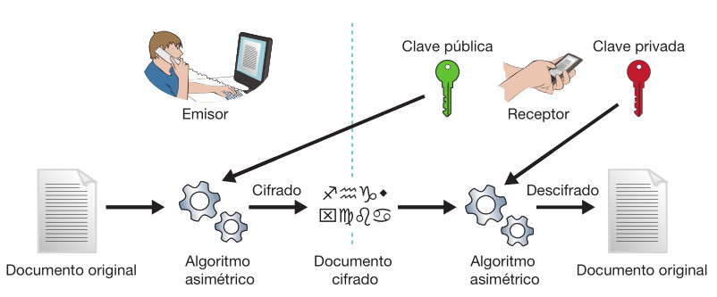
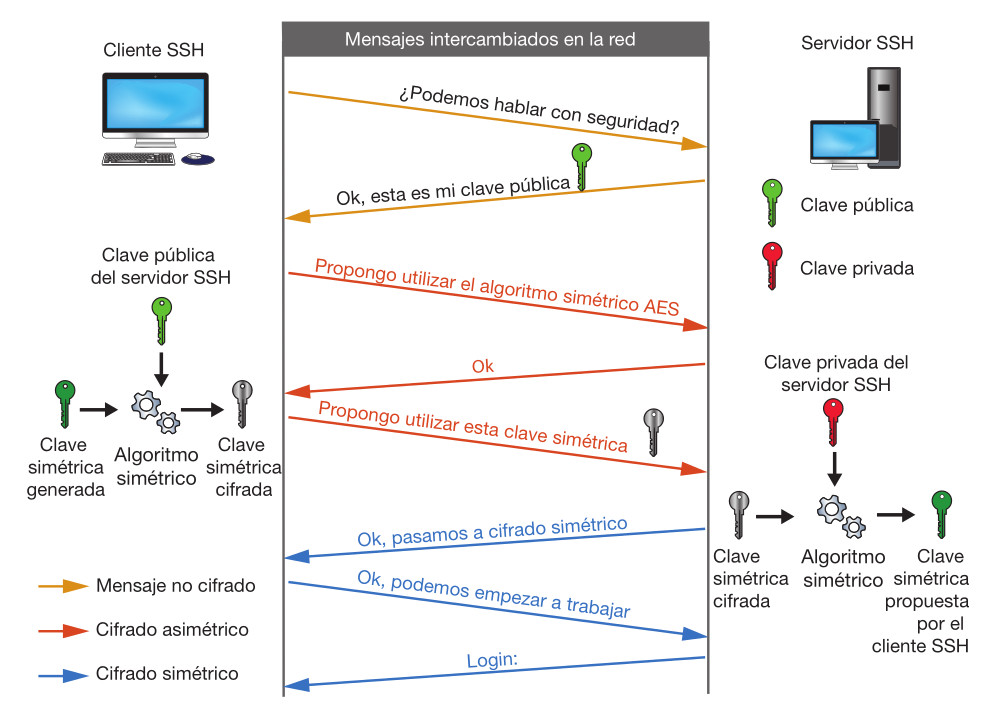

## ¿Por qué cifrar?

* ==La información es poder==.

* Para sacar el máximo partido de una información hay que compartirla con otros individuos

1. El autor del documento (**emisor**) debe **transferirlo a algún soporte** (disco duro, CD, pendrive USB, impresión en papel, cuenta de correo electrónico, upload a un servidor web, etc.) 

2. y **hacer llegar** ese soporte hasta el destino (**receptor**) mediante algún canal de comunicación (empresa demensajería, fax, Internet, etc.).

:::warning Canles inseguros
En los canales de comunicación pueden estar acechando terceras personas con la intención de interceptarlo:
- sobornarán al mensajero para hacer una copia del disco duro/CD/USB o una fotocopia del papel,
- «hackearán» el servidor de correo, 
- capturarán el tráfico de red en el servidor web.

> **Es imposible** asegurar que nunca conseguirán el documento. Nuestra esperanza es que, ==aunque lo tengan y lo puedan leer, no entiendan nada== porque el contenido **estará cifrado**. 
:::

## Criptografía 

La palabra **criptografía** viene del griego **cripto** (que ==significa «ocultar»==) y **graphos** (que ==significa «escribir»==). 

La criptografía consiste en tomar el **documento original** y ==aplicarle un algoritmo== cuyo resultado es un **nuevo documento**. 

El destinatario al recibir el documento, sabrá aplicar el algoritmo para recuperar el documento original.

* Realmente, hace falta algo más que el algoritmo, porque el enemigo también puede conocerlo (incluso lo utiliza en sus propias comunicaciones). Por ejemplo, nosotros tenemos una red wifi con cifrado WPA, pero el vecino también. La privacidad la conseguimos gracias a la clave del algoritmo 

## Criptografía simétrica

* Los algoritmos de criptografía simétrica ==utilizan la misma clave para los dos procesos== : **cifrar** y **descifrar**.

* Son sencillos de utilizar y, en general, resultan bastante eficientes (tardan poco tiempo en cifrar o descifrar). Por este motivo, todos los algoritmos, desde la antigüedad hasta los años setenta, eran simétricos. 
 
* Los más utilizados actualmente son: DES, 3DES, AES, Blowfish e IDEA.

1. El emisor quiere enviar un documento al receptor. 
2. Toma el documento y le aplica el algoritmo simétrico, usando la clave única, que también conoce el receptor. 
3. El resultado es un documento cifrado que ya podemos enviar tranquilamente.
4. El receptor recibe este documento cifrado
5. Le aplica el mismo algoritmo con la misma clave, pero ahora en función de descifrar. 

* Si el documento cifrado no ha sido alterado en el camino y la clave es la misma, ==el resultado será el documento original==.

Los principales problemas de la criptografía simétrica son:

* **la circulación de las claves**: cómo conseguimos que el emisor y el receptor tengan la clave buena. ==No podemos utilizar el mismo
canal inseguro== por el que enviaremos el mensaje (la inseguridad nos ha llevado a cifrar).

* **la gestión de las claves almacenadas**: Si en una empresa hay diez trabajadores y tienen conversaciones privadas con todos, cada uno necesita establecer nueve claves distintas y encontrar nueve canales seguros para actualizarlas cada vez (en total 81 claves y 81 canales). 

¿Cada vez que cambie mi clave tengo que avisar a todos mis compañeros? Es poco manejable.

## Criptografía asimétrica

La criptografía asimétrica resuelve los dos problemas de la clave simétrica:

* **No necesitamos canales seguros** para comunicar la clave que utilizaremos en el cifrado. Podemos adjuntarla en nuestros correos, añadirla al perfil de nuestras redes sociales, «postearla» en un blog, incluso repartirla en octavillas por la calle.

* **No hay desbordamiento** en el tratamiento de **claves y canales**: Si somos nueve empleados, solo necesitamos nueve claves y un solo canal: la intranet de la empresa, un correo destinado a toda la empresa, etc. Y si aparece un empleado nuevo, serán diez claves y el mismo canal.

El cifrado asimétrico no se puede utilizar para cifrar todos los paquetes intercambiados en una red local porque el bajo rendimiento del algoritmo ralentizaría el tráfico. 

En su lugar se adopta un ==esquema híbrido==:

1. Criptografía **asimétrica** solo para el **inicio de la sesión**, cuando hay que generar un canal seguro donde acordar la clave simétrica aleatoria que se utilizará en esa conversación.

2. Criptografía **simétrica** durante la transmisión, utilizando la clave simétrica acordada durante el inicio de sesión. Generalmente se suele cambiar la clave simétrica cada cierto tiempo (minutos) para dificultar más el espionaje de la conversación.

Un ejemplo con el protocolo SSH:

