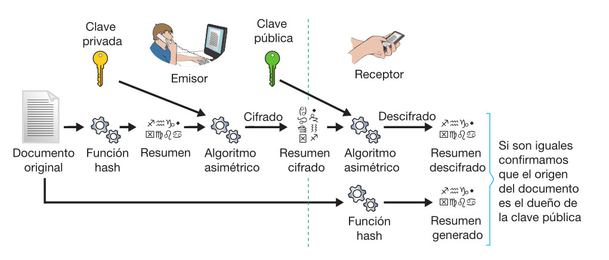

## Firma digital

El procedimiento completo sería:

* El emisor aplica la función hash al original para generar el resumen -> documento resumen

* El emisor toma su clave privada para aplicar el algoritmo asimétrico al documento resumen -> documento resumen cifrado

* El emisor toma la clave pública del receptor para aplicar el algoritmo asimétrico al documento original y al documento resumen -> El resultado es un documento conjunto cifrado que se envía al receptor.

* El receptor, utiliza su clave privada para descifrar los documentos y la clave pública del origen para comprobar la firma.

### Clientes de confianza

El mecanismo de firma también se utiliza para garantizar al servidor que somos un **cliente de confianza**, y así podemos evitar introducir usuario y contraseña (autenticación sin contraseña). 

**Previamente**, el servidor **debe tener** almacenada **la clave pública del cliente**.

1. el cliente empieza una sesión y solicita autenticación sin contraseña.

2. el servidor **genera un documento especial**, llamado ==desafío== (compuesto de cifras y letras elegidas aleatoriamente). 

3. **Busca** en sus ficheros **la clave pública del cliente**, **cifra** con ella **ese desafío** y **se lo envía al cliente**.

4. el cliente **lo recibe**, lo intenta **descifrar con su clave privada** y **devulve el resultado al servidor**. 

5. el servidor **compara** la secuencia de caracteres recibida con el desafío que generó; si son iguales, efectivamente el cliente es de confianza y puede conectar directamente. 

