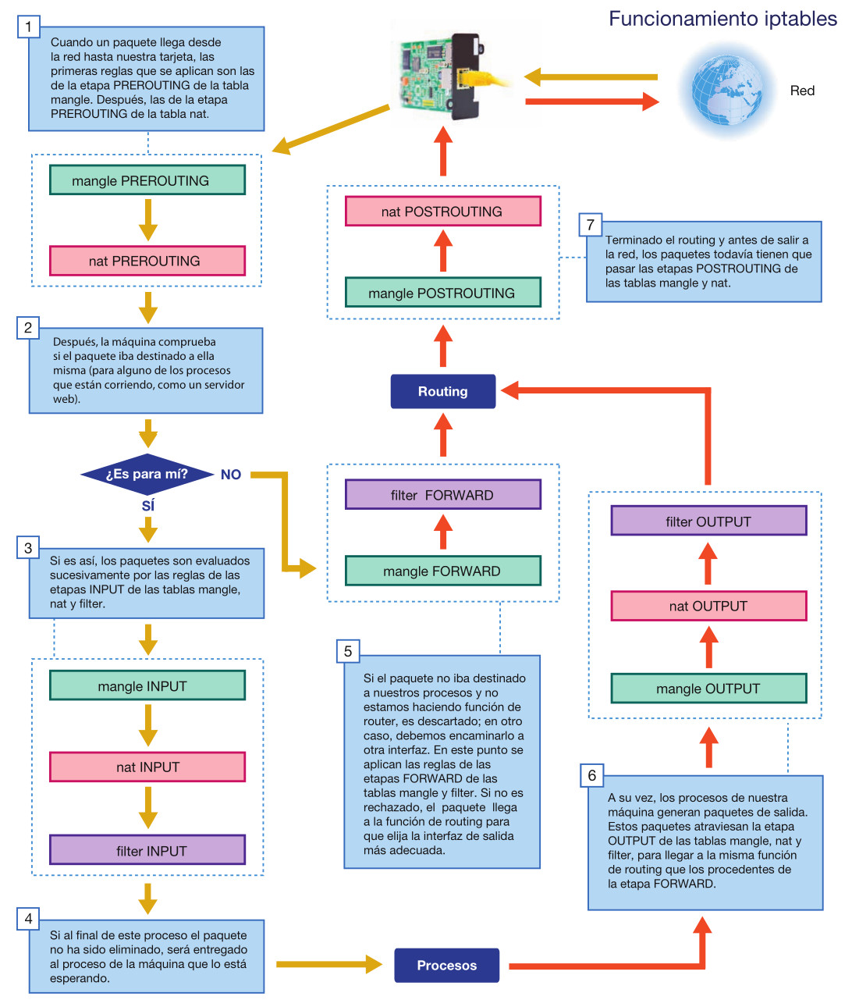

# Iptables

Cuando llega un paquete a la tarjeta de red, el sistema operativo decide qué hacer con él. El resultado de esa decisión puede ser:

* **Descartarlo**: Si el destinatario del paquete no es nuestra máquina o, aunque lo sea, ningún proceso actual lo espera, el paquete termina aquí. Por ejemplo, llega una petición http a una máquina que no tiene un servidor web arrancado: la máquina lo ignora.

* **Aceptarlo**:
  - ==porque es para nosotros y hay un proceso que sabe qué hacer con ese paquete==. Sería el ejemplo anterior, pero ahora sí tenemos un servidor web funcionando.

  - ==aunque no sea para nosotros: porque somos un router== y vamos a enviarlo por otra interfaz. En algunos casos llegaremos a modificar las cabeceras del paquete, como veremos más adelante.

  - aunque ==no es para nosotros y tampoco somos un router==: pero estamos escuchando todos los paquetes porque ==somos un sniffer de red==.

### Fases
> también se denominan **chain**, porque ==encadena una regla con otra==.

En el caso de Linux, iptables permite introducir reglas en cada una de estas fases:

* **INPUT**: Cuando llega el paquete para un proceso nuestro pero todavía no se lo hemos entregado

* **FORWARD**: Cuando somos un router y estamos a punto de traspasar el paquete de una interfaz a otra

* **OUTPUT**: Cuando un paquete está listo para salir por una interfaz

* **PREROUTING**: Se ejecuta antes de input. Sirve para obviar el enrutamiento porque sabemos exactamente qué tratamiento dar a esos paquetes. 

* **POSTROUTING** (después de output y después de forward): Se utiliza para aplicar alguna modificación a los paquetes que están a punto de abandonar la máquina.

### Reglas

Las reglas de iptables tienen una lista de condiciones y una acción, de manera que, cuando un paquete cumple todas las condiciones de una regla, se ejecuta la acción. 

Las acciones pueden ser simplemente aceptar o rechazar el paquete, o también modificarlo.

### Tablas

Pero no todas las acciones están disponibles en todas las situaciones. Por esto las reglas se agrupan en **tres tablas principales**:

* **FILTER**: Es la tabla principal. Su misión es ==aceptar o rechazar== paquetes. Es el firewall propiamente dicho.

* **NAT**:  Las reglas de esta tabla ==permiten cambiar la dirección de origen o destino== de los paquetes.

* **MANGLE**: En esta tabla podemos alterar varios campos de la cabecera IP, como el ToS (Type of Service). Se suele usar para aplicar QoS (Quality of Service), marcando los paquetes de determinados servicios para luego priorizarlos.

Dentro de cada tabla, las reglas se agrupan a su vez por la etapa del procesamiento de paquetes donde se aplican (prerouting, input, etc.), aunque no todas las tablas tienen
todas las etapas. 

Para cada etapa hay una lista de reglas que se recorre secuencialmente hasta que el paquete cumple una regla. 

En ese momento se ejecuta la acción asociada a la regla y se deja de aplicar el resto de las reglas de esa etapa (salvo la acción LOG, como veremos más adelante). 

Si el paquete no cumple ninguna regla de esa etapa, se aplica la acción por defecto de la etapa.

